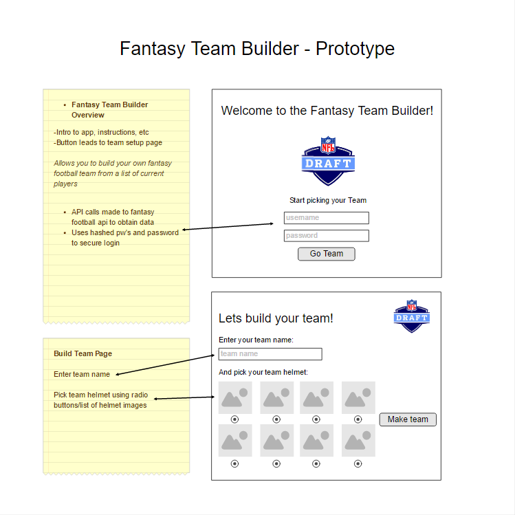
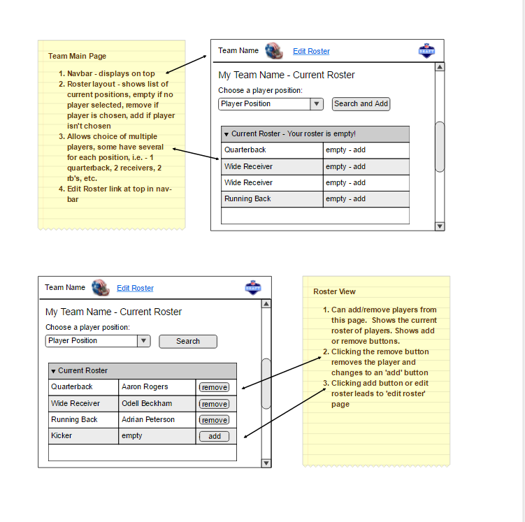
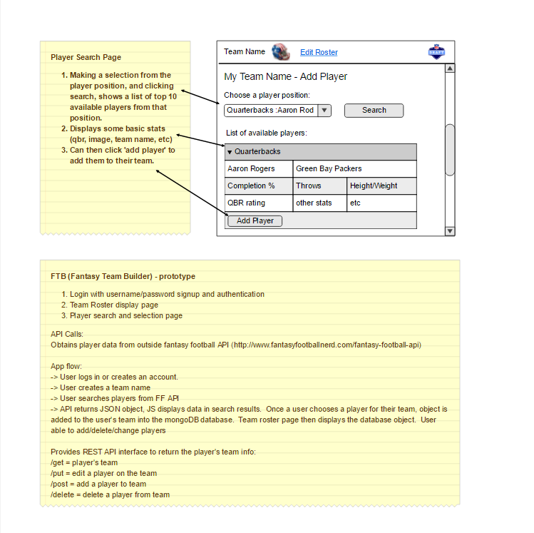

# Thinkful Node/Fantasy Football Team Builder App

## Utilizes the following:
*Node.js, express, mongodb, JavaScript, Jquery, HTML5,CSS3
*Create a front end for building a personal fantasy football team
*Utilize external API queries for actual player data
*Provide API endpoints for external querying of DB
*Provide authentication for users of app
*Provide chat functionality between users
*Display a 'news ticker' of external FF news
*Make it fun and visually appealing

##Prototype

