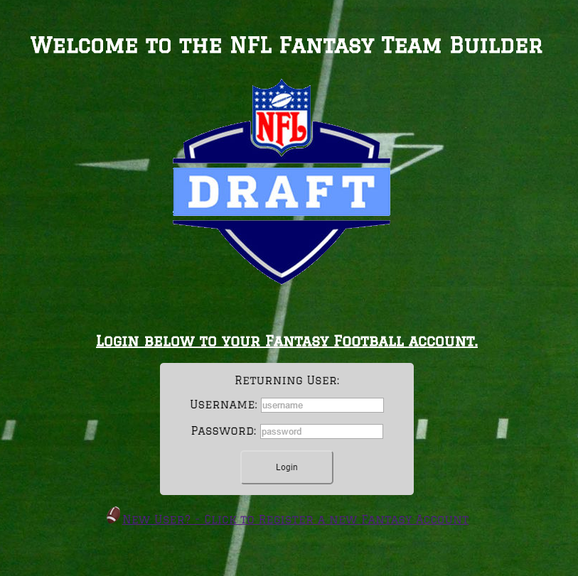
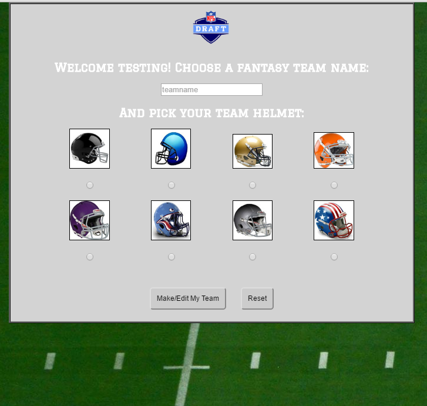
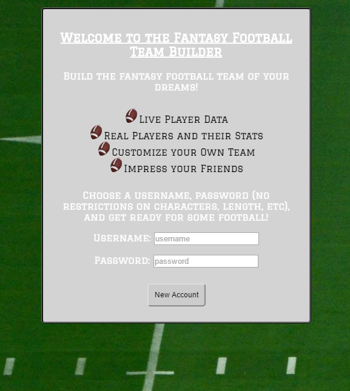
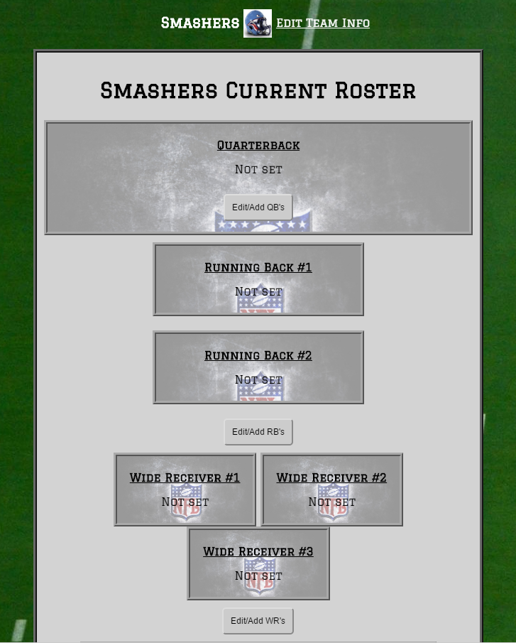
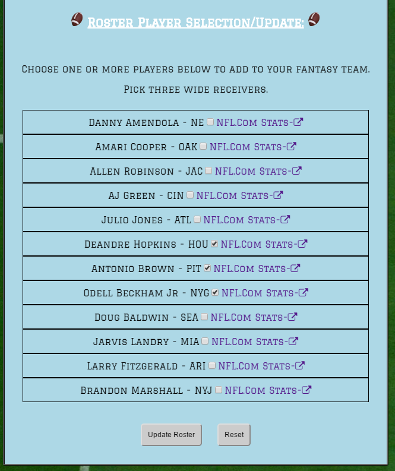
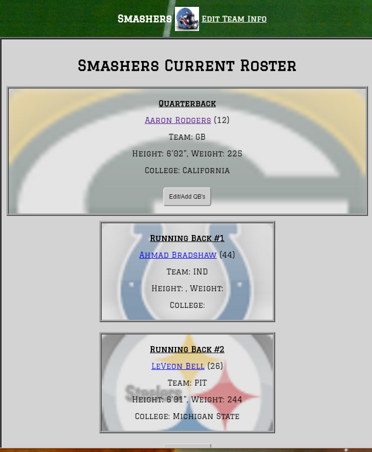

# Thinkful Node/Fantasy Football Team Builder App

## Utilizes the following:
* Node.js, express, mongodb, JavaScript, Jquery, HTML5, CSS3, bcrypt
* Full-stack app for building a personal fantasy football team
* Utilize external API queries for actual player data
* Provide dozens of API endpoints for querying of DB
* Provide authentication for users of app via bcrypt and hashed passwords
* Make it fun and visually appealing - uses real players, real data from end of 2015 season
* Links to NFL.com for additional player research 

## Screenshots and UI/Functionality

### Main Page

### Set your Team Name and Choose a Logo Helmet

### Signup for a New Account - all accounts protected via salted/hashed passwords

### Empty main roster page

### Choose from real players, conduct research on NFL.com

### Your updated roster with backgrounds from the player's real teams

## API Documentation

### Team Endpoints
* GET - /service/teams - Lists the current player teams
* GET - /service/teams/{teamname} - Returns the team by team name

### Users Endpoints
* GET - /service/users - Lists all current users

### Players Endpoints
* GET - /service/players/qb - Lists all the Quarterbacks in the DB
* GET - /service/players/rb - Lists all the Running Backs in the DB
* GET - /service/players/wr - Lists all the Wide Receivers in the DB
* GET - /service/players/k - Lists all the Kickers in the DB
* GET - /service/players/def - Lists all the Defenses in the DB
* GET - /service/players/qb/{qb_pid} - Returns a specific QB from the DB by PID
* GET - /service/players/rb/{rb_pid} - Returns a specific RB from the DB by PID
* GET - /service/players/wr/{wr_pid} - Returns a specific WR from the DB by PID
* GET - /service/players/k/{k_pid} - Returns a specific K from the DB by PID
* GET - /service/players/def/{def_pid} - Returns a specific DEF from the DB by PID

### 22 additional API endpoints for internal testing/development/application use

## Additional features I'd like to add in Version 2.0
* Play against other teams!
* Chat between other players
* News stories via ticker
* Automatically updated player data